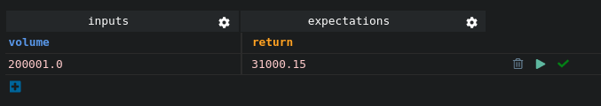

## Play Button
To run your test, you can click on the <i class="fas fa-play" style="color:green"></i>`Play` button and get a Check icon on the right when the test passes.

If the test fails, you will get a <i class="fas fa-times" style="color:red"></i>`Cross` icon to indicate this. You can then make the test pass by clicking on the <i class="fas fa-bolt" style="color:#E6D838"></i>`Bolt` icon to correct it.

