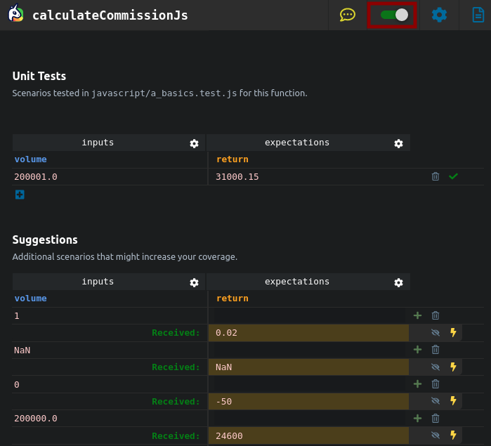

## Watch Mode

If you want your tests to run automatically while you code, use Watch Mode by activating it with the toggle in the top right corner.

Your tests will then run automatically as you code and you will see your units' behavior evolution live.