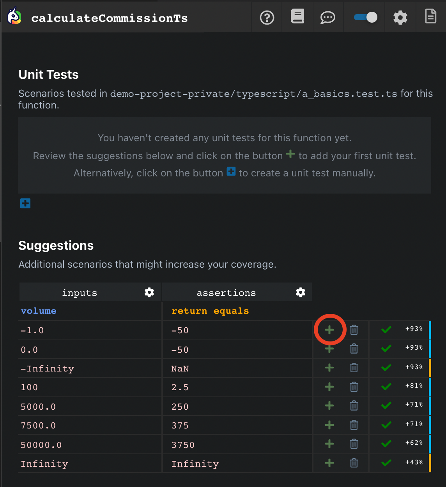
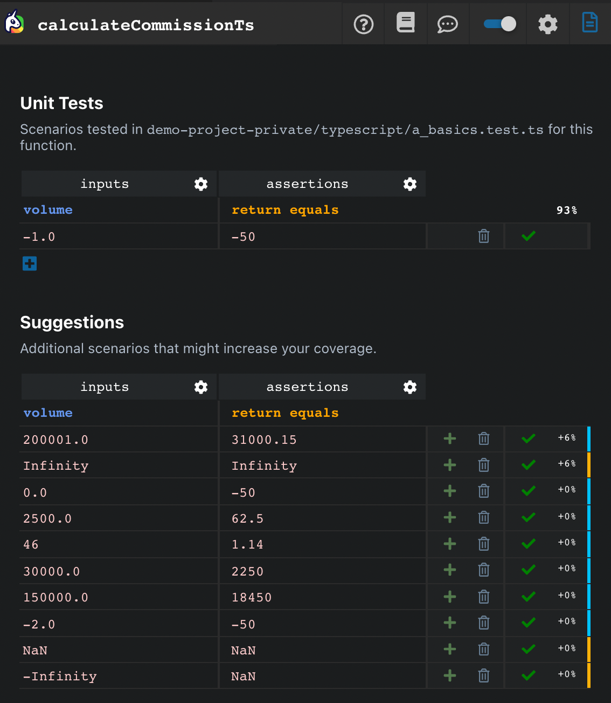
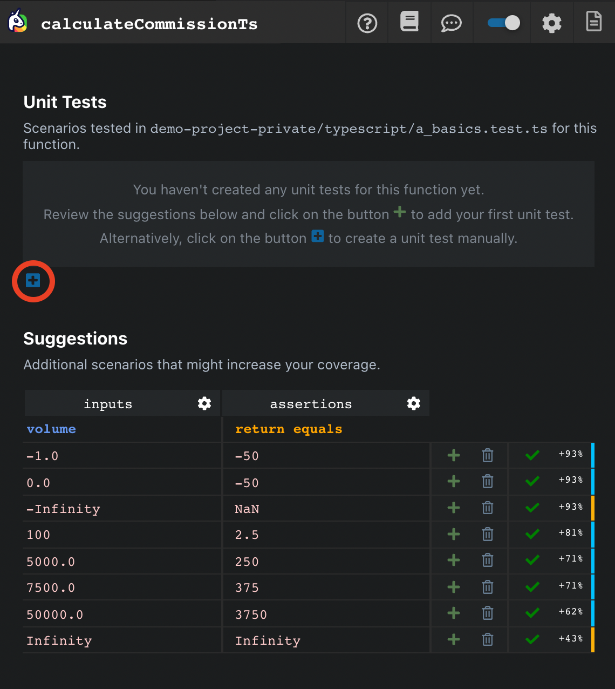
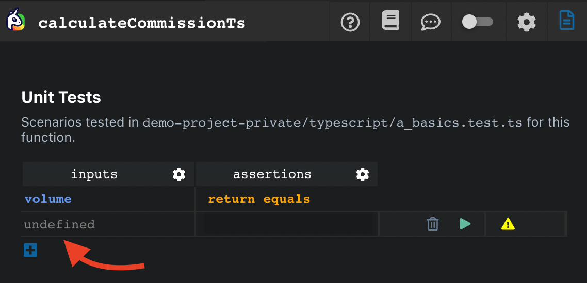
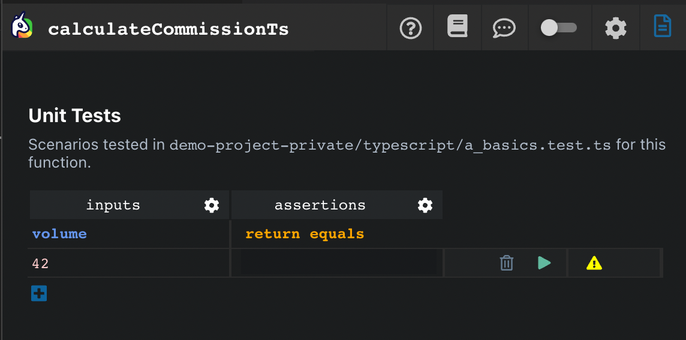

# Generate your first Unit Test

Ponicode interface is composed of 2 sections : 

- **Unit tests**: Shows test cases of your test file
- **Suggestions**: Suggestions provided by Ponicode AI for useful test cases

You can create unit tests from these two sections.

## Using AI-generated suggestions

Creating unit test with the help of our AI is super simple :

When opening Ponicode on the function you want to test, suggestions will appear.

Simply add the ones you want by clicking on the plus right next to it :

    

And voilà! You can see the suggestion added to your list of units tests, and you can see the test written by clicking on the file in the top right corner.

    

## Manually adding a test

However, if you want to test your function with specific parameters, you can write your own tests too only with the value you want (we'll do the rest promise)

To do so, add a test case by clicking on the blue cross shown as below : 

    

After that, you can write the wanted value(s) in the input cell, as shown in the screenshot below :

    

When you're done, you'll see the value in the cell.

And voilà! Check out your freshly generated test by clicking on the file in the top right corner! 

    

