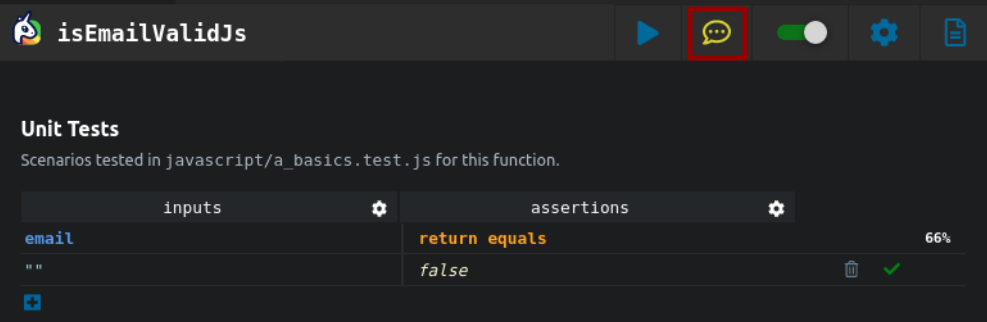
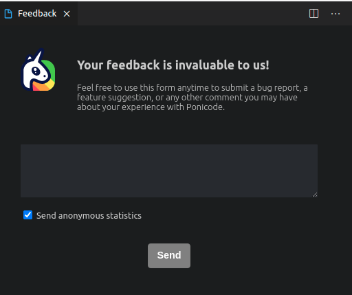

# Feedback button
If you want to contact us with a problem or comment about the Ponicode extension, there is a <i class="far fa-comment-dots" style="color:yellow"></i>bubble button that opens an interface to send us your feedbacks.

Once the feedback window is open, simply write your message and click on Send.

