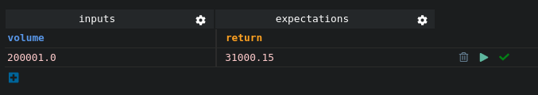
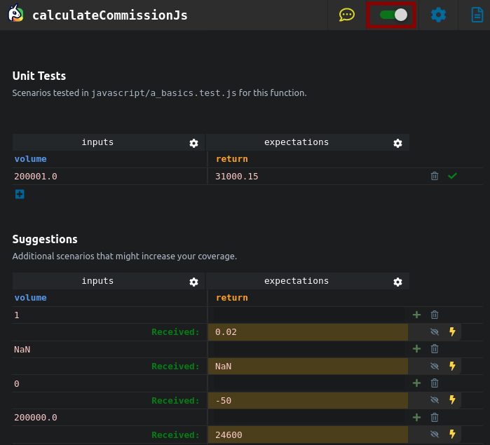

# Running your test

There are 2 ways of running your tests: in the Ponicode interface, or in your terminal with jest.

## In the Ponicode interface

The Ponicode interface has two options to run your tests: manual mode or watch mode.

### Manual mode

You can run each test individually by clicking on the play button. If the test passed, you will see a green check right of your test row.


If the test fails, you will get a cross icon to indicate this. You can then make the test pass by clicking on the bolt icon to correct it.


### Watch mode

Watch mode can automaticaly run your tests when needed. You can enable it with the toggle in to top right corner.


## Troubleshooting

### Why am I getting "Failed to import some files" ?


This probably means that you have a typo in your imports or that the module you are importing is not installed.

### Why am I getting "Failed to evaluate beforeEach" ?

<p >
    
</p>

This usually means that there is a syntax error in the before each.
Make sure that all your identifier are imported in the test file and that your classes are instatiated correctly.

## Running your test in the terminal

Ponicode write your test in jest format. You can run the tests in your terminal with jest.
Jest is installed with this command:
`npm install --save-dev jest`
or
`yarn add --dev jest`

Then add this configuration to your package.json:
```
{
	"scripts": {
		"test": "test"
	}
}
```

You can run all your tests with `npm run test` or `yarn run test`

You can run tests files individually with `jest FILE_NAME.test.js`

For advanced use of jest, refer to the [official docs](https://jestjs.io/docs/getting-started)

