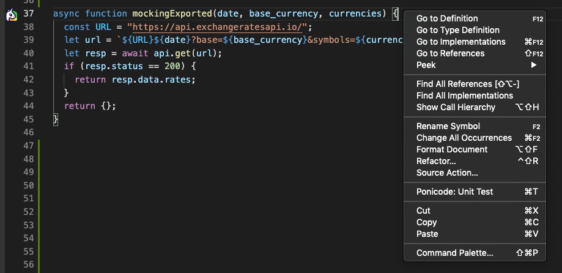

# Open Ponicode interface

Look for any `Javascript`, `Typescript` or `Python` function with a Ponicode icon beside.

This icon indicated that you can use Ponicode on this function.

A clickable decorator will appear above the all supported functions. Select `Ponicode: Unit test` to open the interface.

    

## Keyboard shortcut

You can also open the interface by selecting a function and typing `⌘ + T` or `Ctrl + T` depending on your OS.

## Context menu

Finally you can right click on the function you want to test, and select `Ponicode: Unit test` to open the interface.

