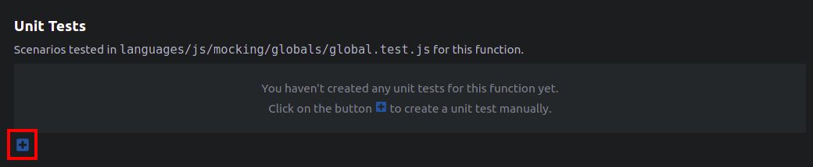

# The Unit Tests Section

The Unit Tests section in the Ponicode interface is your way to directly interact with your test file. When you open the interface, Ponicode looks for your test file (more information about test file location [here](../configuration/testLocation.mdd)). In the file exists, this section will be populated with the test cases found in said file. If not, Ponicode creates the file for you as soon as you add your first test case.

When you add or remove a test case in this section, your test file is updated in real time and vice versa.

## Adding test cases to the section

Adding new test cases to the Unit Tests section can be done in several ways. You can either create a test case manually or add a test case from the Suggestion section.

## Removing test cases

To remove a test case, simply click on the 🗑 icon at the right side of the test case row.

## Running test cases

You might want to run your test cases to see wether they pass or not. Take a look to the doc deditacted to [running tests](./runningTests.md)
